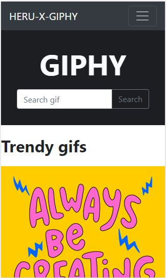
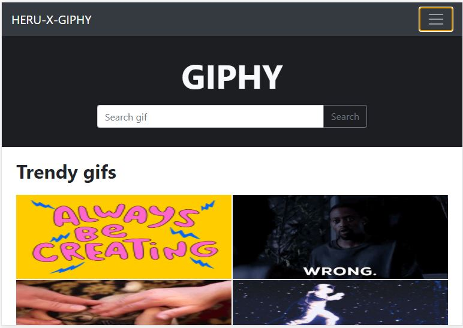
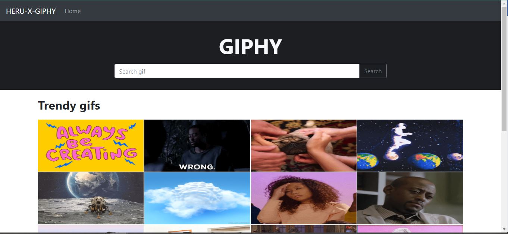

# HERUxGIPHY APP

This basic gif search engine app was develop with ReactJ, Redux  and it consumes Giphy API. 

## Demo

Live demo: https://limitless-bastion-82519.herokuapp.com/

### Mobile:



### Medium size:



### Desktop:




## Installation

### Prerequisites

Install [Node.js](https://nodejs.org/es/download/)

### Step 1

Clone this repository.

```
git clone https://github.com/Guzd/giphy-app.git
```

### Step 2

Install it.

```
yarn install
```

### Step 3

Run the app.

```
yarn run dev
```

### Step 4

Then you can go to http://localhost:3000 in your browser.
Enjoy!

